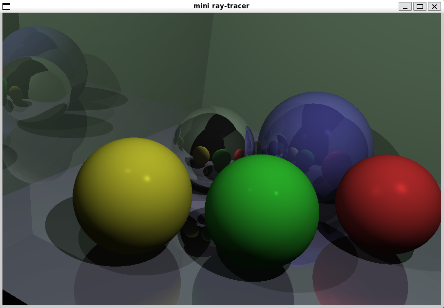

# raytrace

간단한 레이트레이싱(ray-tracing)을 구현해 본 코드입니다.

맥OS에서 만들기 시작했고, 업로드 때는 Windows 10 + WSL2 환경에서 실행을 확인했습니다.

그래픽 처리는 [SDL2](https://www.libsdl.org/)를 사용합니다.

퐁 반사 모델(Phong reflection model)에 대한 이해가 기본이 됩니다.
수학쪽으로는 삼각함수, 벡터, 공간기하 등에 대한 지식이 필요합니다.
관련된 내용을 [유튜브 동영상](https://www.youtube.com/@music-reboot/playlists) 에 설명해 두었습니다.

각종 환경과 물체 기술은 rt.conf 에서..

- R : 해상도
- c : 카메라 위치
- kd : 확산광(diffuse light)의 세기
- A : 주변광(ambient light)의 세기
- l : 광원

카메라 조작은 아래 12개의 키로..

- W A S D Q E
- 화살표, Del, PgDn

